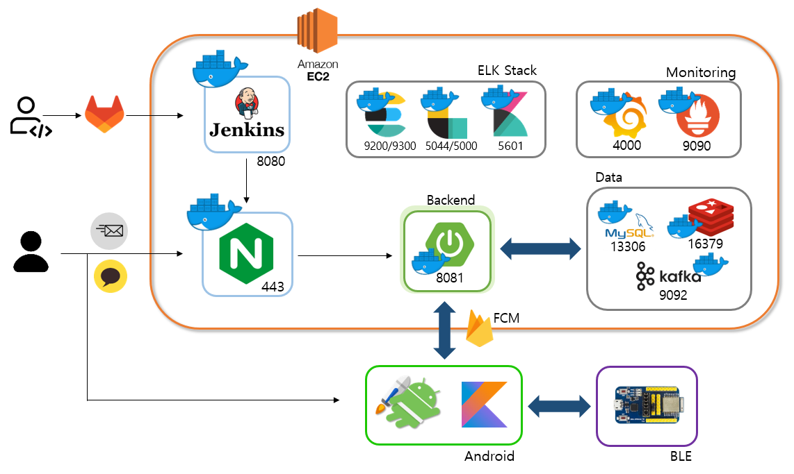
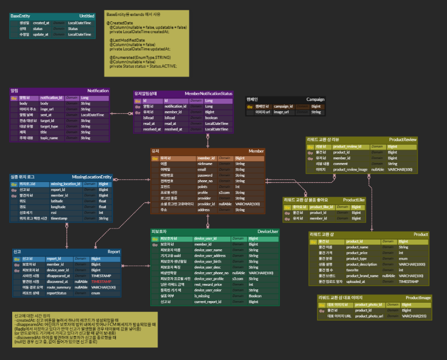

# 🛡️ BODA(보다)

> "BODA : 사회 안전망 서비스"
>

### 🎁 기획 배경

#### "BLE 기반 실종 방지 플랫폼 "위험을 미리 감지하고, 빠르게 대응한다!"

본 프로젝트는 BLE(Bluetooth Low Energy) 기술과 실시간 위치 추적을 기반으로, 아동, 노인, 반려동물 등 보호가 필요한 대상의 실종을 예방하고, 실종 시 신속한 대응을 가능하게 하는 사회 안전망 구축 서비스입니다.

&nbsp;

## 📒 주요 기능
| 기능 | 설명 |
| --- | --- |
| 📡 BLE 스캔 | 주변기기와 BLE 태그의 신호 수신 및 RSSI 기반 거리 추정 |
| 🚨 거리 이탈 알림 | 보호자와 BLE 태그 간 일정 거리 이상 이탈 시 알림 발생 |
| 🆘 실종 신고 | 실종 신고 시 주변 일반 사용자들의 앱이 자동 BLE 스캔 모드 진입 |
| 🗺️ 위치 시각화 | Google Maps 기반 현재 위치 |
| 🎁 포인트 & 보상 시스템 | 제보자에게 포인트 지급, 누적 포인트로 보상 교환 가능 |
| 🔋 백그라운드 BLE 서비스 | 앱이 꺼져 있어도 BLE 스캔 및 실시간 알림 지속 작동 |
| 🔐 인증 및 보안 | 사용자 인증 |
| 🧠 AI 경로 예측 | AI 알고리즘 기반 실종자 이동 경로 예측 |
| 🤝 공유형 탐색 네트워크 | 일반 사용자들이 자발적으로 참여하는 위치 공유 및 탐색 시스템 |

&nbsp;
## ⚒ 기술 스택

### Android


### Back-End


### DB


### INFRA


### Embedded


&nbsp;

## 📂 프로젝트 구조

### 프론트엔드
```
com/taken/boda/  (앱의 메인 패키지: /app/src/main/java/com/taken/boda/)
├── di/                         # 의존성 주입 (Hilt/Dagger) 관련 모듈 정의 폴더
├── ble/                        # 블루투스 저전력(BLE) 관련 기능 폴더
│   └── worker/                 # BLE 관련 백그라운드 작업 Worker 폴더
├── navigation/                 # Jetpack Navigation 관련 클래스 폴더
│   └── navhost/                # NavHost 관련 파일 폴더
├── presentation/               # 프레젠테이션 레이어 (UI 로직 및 화면 구성) 폴더
│   ├── auth/                   # 인증 (로그인, 회원가입) 관련 UI 폴더
│   │   ├── signup/             # 회원가입 관련 UI 폴더
│   │   └── viewmodel/          # 인증 관련 ViewModel 폴더
│   ├── device/                 # 기기 관리 관련 UI 폴더
│   │   ├── add/                # 기기 추가 관련 UI 폴더
│   │   └── guide/              # 기기 사용 가이드 관련 UI 폴더
│   ├── home/                   # 홈 화면 관련 UI 폴더
│   ├── main/                   # (MainActivity에서 사용되는) 메인 화면 관련 UI/로직 폴더
│   ├── map/                    # 지도 화면 관련 UI 폴더
│   ├── mypage/                 # 마이페이지 관련 UI 폴더
│   │   ├── main/               # 마이페이지 메인 관련 UI 폴더
│   │   ├── announce/           # 공지사항 관련 UI 폴더
│   │   ├── notice/             # 알림 관련 UI 폴더
│   │   ├── report/             # 신고 관련 UI 폴더
│   │   └── update/             # 회원정보 수정 관련 UI 폴더
│   ├── onboarding/             # 온보딩(앱 처음 실행 시 안내) 관련 UI 폴더
│   ├── shop/                   # 상점 관련 UI 폴더
│   │   ├── main/               # 상점 메인 관련 UI 폴더
│   │   ├── detail/             # 상품 상세 관련 UI 폴더
│   │   ├── search/             # 상품 검색 관련 UI 폴더
│   │   └── write/              # 상품 후기 작성 관련 UI 폴더
│   └── splash/                 # 스플래시(앱 로딩) 화면 관련 UI 폴더
├── ui/                         # UI 공통 요소 폴더
│   └── theme/                  # Jetpack Compose 테마 관련 폴더
└── utils/                      # 앱 모듈 내에서 사용되는 유틸리티 클래스/함수 폴더
```

### 백엔드
1. Spring Boot
```
src/
└── main/
    ├── java/
    │   └── com.ac102.taken/
    │       ├── domain/                         # 도메인 계층 (업무별 핵심 로직)
    │       │   ├── auth/                       # 인증/인가 도메인
    │       │   ├── campaign/                   # 캠페인 관련 도메인
    │       │   ├── deviceUser/                 # 기기 사용자 관련 도메인
    │       │   ├── member/                     # 회원 관련 도메인
    │       │   ├── missingLocationLog/         # 실종 위치 로그 도메인
    │       │   ├── report/                     # 신고 관련 도메인
    │       │   ├── reward/                     # 리워드 관련 도메인
    │       │   └── shop/                       # 샵/상점 관련 도메인
    │       │
    │       ├── global/                         # 공통 모듈 (전역 설정, 예외 등)
    │       │   ├── config/                     # 설정 클래스 (Security, WebConfig 등)
    │       │   ├── controller/                 # 전역 컨트롤러 또는 공통 처리용
    │       │   ├── exception/                  # 예외 처리 관련 클래스
    │       │   ├── model/                      # 공통 DTO, VO 등
    │       │   ├── repository/                 # 공통 Repository
    │       │   └── service/                    # 공통 서비스
    │       │
    │       └── TakenApplication.java           # 메인 애플리케이션 진입점
    │
    └── resources/
        ├── elasticsearch.mappings/             # 엘라스틱서치 매핑 JSON 등 설정
        ├── fcm/                                # Firebase Cloud Messaging 설정 관련 파일
        ├── application.yml                     # 기본 설정
        ├── application-local.yml               # 로컬 환경 설정
        └── application-prod.yml                # 운영 환경 설정
```
2. FastAPI
```
TAKEN_AI/
├── .venv/                              # Python 가상환경 (의존성 격리)
├── app/                                # 애플리케이션 핵심 코드
│   ├── __pycache__/                    # Python 캐시 파일 (자동 생성됨)
│   ├── routers/                        # FastAPI 라우터 모듈 (API 엔드포인트 구성)
│   │   ├── __pycache__/                # 캐시 파일
│   │   ├── export.py                   # CSV/파일로 데이터 export 관련 API
│   │   ├── predictor.py                # 예측 기능 관련 API 엔드포인트
│   │   └── train.py                    # 모델 학습 관련 API 엔드포인트
│   ├── weights/                        # 학습된 모델 가중치 저장 디렉터리
│   │   └── routepred.pt                # 저장된 모델 가중치 파일 (PyTorch)
│   ├── config.py                       # 환경설정 및 설정값 정의
│   ├── export_csv.py                   # 데이터 export 로직 구현
│   ├── main.py                         # FastAPI 애플리케이션 진입점
│   ├── model.py                        # 모델 정의 (PyTorch 모델 구조)
│   ├── predictor.py                    # 예측 로직 구현 (모델 로딩 및 추론)
│   ├── schemas.py                      # Pydantic 스키마 (입출력 데이터 검증)
│   └── train.py                        # 모델 학습 로직 구현
├── .env                                # 환경변수 파일 (비밀번호, 경로 등)
├── .gitignore                          # Git에서 제외할 파일 목록
├── README.md                           # 프로젝트 설명 문서
└── requirements.txt                    # Python 의존성 목록 (pip install -r)
```

### 시스템 아키텍처



### ER Diagram



&nbsp;

## 👨‍👩‍👧‍👦 팀원 정보
<div align="center">


| 🖼️ **사진** | 🧑‍💻 **이름** | 🏆 **역할** | 🚀 **이메일주소** |
| --- | --- | --- | --- |
|  | **강대규** | 팀장, 백엔드, PM 담당 | ethan2024@naver.com | 
|  | **김아름** | 프론트엔드 개발자 | kar870428@gmail.com  |
|  | **양성원** | 백엔드 개발자 | tjddnjs6331@naver.com | 
|  | **이지운** | 프론트엔드 개발자, 디자이너 | ravenjw@naver.com |
|  | **정유선** | 백엔드 개발자, 인프라 | seon7129@naver.com | 
|  | **정지원** | 프론트엔드 개발자 | littlesam95@naver.com |
                                                         

</div>

&nbsp;

## 🛠 담당 파트

### 강대규

- **AI 기반 경로 예측 서버 개발 및 통합**
    - **FastAPI 기반 AI 서버 구축**
        - LSTM + MDN 기반 실종 경로 예측 모델 설계 및 학습 코드 구현
        - MC Dropout을 활용한 Top-k 확률적 경로 예측 모델 적용
        - PyTorch 기반 모델 학습 후 `.pt` 파일로 저장 및 추론 연동
        - GPU 서버 환경에서 모델 학습 및 추론 자동화
        
    - **AI 예측 API 개발 및 연동**
        - FastAPI로 학습 및 추론 라우터 구현 (`/train`, `/predict`)
        - Spring Boot 서버와의 REST API 연동을 위한 요청/응답 스키마 정의
        - Swagger UI를 통한 예측 API 테스트 환경 제공
        - 추론 결과를 리스트 형태로 반환하여 다양한 경로 선택 가능하도록 처리

- **DeviceUser API 및 위치 기반 로직 구현**
    - **보호 대상자 등록 및 BLE 장치 관리 API 구현**
        - `DeviceUser` 등록/수정/삭제 API 개발
        - BLE 기기 UUID, 색상, 설명 등의 메타데이터 등록 기능 지원
        - JWT 기반 인증 처리 및 사용자별 접근 권한 제어

    - **위치 기반 실종 예측을 위한 데이터 흐름 설계**
        - BLE 신호를 통해 수집된 위치 데이터를 MySQL에 주기적 저장
        - 보호자와 함께 다닌 경로 데이터를 기반으로 예측 학습 데이터 구성
        - 실종 발생 시, AI 서버에 위치 이력 데이터를 전송하여 예측 경로 수신

- **데이터 관리 및 내보내기**
    - **학습 및 추론용 CSV 데이터 자동 생성 도구 개발**
        - 보호자의 위치 로그를 기반으로 슬라이딩 윈도우 방식 학습 데이터 구성
        - `export_csv.py`를 통해 DB → CSV 자동 변환 로직 작성
        - 데이터 증강(Augmentation) 기법을 활용하여 경로 다양성 확보

### 김아름

- **BLE Scan 기능 구현**
    - Foreground Scan, Background Worker Scan, PendingIntent 기반 Scan 방식 구현
    - BLE 디바이스 탐지 후  실시간 위치 전송 기능 연계
    - Android 12 이상 백그라운드 스캔 권한 및 제한 대응
    
- **BLE GATT 연결 기능 구현**
    - BLE 디바이스와 GATT 프로토콜 기반 연결 및 데이터 송수신 기능 구현
    - 연결 해제 시 사용자에게 노티피케이션 전송 기능 구현

- **FCM 기반 메시징 기능 구현**
    - 실종 대상 전파를 위한 FCM 메시지 처리 로직 구현 (Push 수신 → 업데이트 연계, 스캔 시작/중지)
    - FCM 토큰 갱신 및 서버 전송 기능 구현
    - 주제 구독(Topic Subscription) 기반 유연한 메시지 전파 구조 설계

### 양성원

- **백엔드 개발**
  - **인증 및 보안 시스템 구현**
    - **JWT 기반 인증/인가 시스템 설계 및 구현**
      - Access Token / Refresh Token 기반 로그인 및 토큰 재발급 로직 구현
      - Spring Security와 JWT를 연동하여 사용자 인증 및 인가 처리
      - Redis를 이용한 Refresh Token 저장 및 만료 주기 관리로 보안 강화

    - **로그인 세션 흐름 설계 및 보안 고려사항 적용**
      - HTTP Header 기반 토큰 전송 및 유효성 검증 로직 구현
      - 토큰 탈취 방지를 위한 재발급 정책 및 예외 처리 구성

  - **사용자 관련 API 개발**
    - **회원 관리 도메인 설계 및 RESTful API 구현**
      - 회원가입, 로그인, 로그아웃, 토큰 재발급 등 `Member`, `Auth` 도메인 API 설계 및 구현
      - 사용자 정보 조회 및 수정, 비밀번호 변경 등 사용자 관련 기능 구현
      - Spring Boot 기반 REST API 서버 구축 및 JWT 기반 인증 연동

    - **API 명세 및 테스트 환경 구성**
      - Swagger UI를 통한 API 문서화 및 테스트 환경 제공
      - 요청/응답 DTO 스키마 설계 및 예외 응답 구조 표준화

  - **보상 시스템 로직 개발**
    - **제보 활동 기반 포인트 적립 시스템 구현**
      - 사용자 제보 이벤트 발생 시 포인트 자동 적립 로직 개발
      - 포인트 적립/조회 API 제공

  - **BLE 기반 위치 추적 기능 구현**
    - **BLE 신호 기반 위치 계산 알고리즘 적용**
      - BLE 장치에서 수신한 RSSI 값을 활용한 사용자 위치 추정 로직 개발
      - 단일 측정값의 노이즈를 줄이기 위해 가중 평균 기반 RSSI 필터링 알고리즘 구현

### 이지운

- **온보딩 페이지**
  - 앱 최초 진입 시 온보딩 UI 및 흐름 설계 (앱 기능 소개, 권한 안내 등)

- **인증 및 사용자 관리 기능**
  - 이메일/비밀번호 기반 회원가입 및 로그인 폼 구현
  - JWT Access Token 및 Refresh Token 저장 및 관리
  - 로그인/회원가입 요청 후 응답 처리 및 사용자 정보 상태 전역 관리

- **카카오 소셜 로그인 연동**
  - 카카오 OAuth 인증 코드 요청 및 콜백 처리
  - 인가 코드 백엔드 전송 및 로그인 처리 후 사용자 정보 저장

- **실종 신고 및 위치 기반 지도 시각**
  - 실종 신고 요청 전송 폼 구현
  - 실종자 위치 데이터 조회 api 연동
  - 실종자 AI 예상 위치 데이터 조회 API 연동
  - Kakao Map API를 사용하여 위도/경도 기반 도로명 주소 변환

### 정유선

- **인프라 구축 및 관리**
    - **Docker 기반 멀티 컨테이너 아키텍처 설계 및 구현**
        - Spring Boot, MySQL, Redis, Elasticsearch, Kafka, Nginx 컨테이너 구성
        - 컨테이너 간 네트워크 구성 및 서비스 간 통신 최적화
    - **모니터링 시스템 구축**
        - Prometheus, Grafana 기반 시스템 모니터링 환경 구축
        - Loki로 중앙화된 로그 관리 시스템 구현
        - 실시간 성능 지표 수집 및 대시보드 구성
        - Filebeat, Logstash, Elasticsearch, Kibana(ELK)를 이용해 MySQL slow query 및 Spring Boot 로그 수집/모니터링
    - **CI/CD 파이프라인 통합**
        - Jenkins 연동을 통한 자동화된 배포 체계 구축
        - 서비스별 컨테이너 이미지 빌드 및 배포 자동화
- **백엔드 개발**
    - **실종 도움 요청 API 구현**
        - 실종 요청 기반 Report 생성 API 개발
        - 일반 위치 로그 및 실종자 위치 로그를 MySQL과 Elasticsearch에 저장
        - Kibana를 통한 위치 로그 시각화
        - Kakao Map API를 이용해 위경도를 도로명 주소로 변환
    - **부하테스트 진행 및 위치 로그 최적화**
        - 위치 로그 저장에 대해 JMeter로 부하 테스트 수행
        - Kafka 큐잉 도입을 통해 처리 성능 개선
            - 평균 응답 시간: 646.65ms → 51.49ms (약 92% 감소)
            - Apdex 지수: 0.704 → 1.000 (약 42% 개선, 기준치 0.85 초과)

### 정지원

- **프론트엔드 개발**
  - **회원 정보 조회/수정 UI 및 API 연동**
    - 사용자 프로필 정보 조회 및 수정 화면 구성
    - API 연동을 통한 정보 불러오기 및 수정 요청 처리
  - **FCM 브로드캐스트 요청 연동**
    - 브로드캐스트 메시지 전송 화면 구성
    - FCM API와 연동하여 실시간 푸시 전송 요청 처리
  - **실종자 위치 추적 화면 구현**
    - 실종자 위치 이력 조회 UI 구현 (지도 또는 리스트 기반)
    - 위치 조회 API 연동을 통한 실시간 정보 표시
  - **Shop 및 포인트 기능 UI 구현**
    - Shop 아이템 목록 조회 및 구매 화면 구현
    - 포인트 적립/사용 내역 시각화 및 API 연동 처리

- **백엔드 개발**
  - **회원 정보 관리 API 개발**
    - 회원 정보 조회 및 수정 기능 API 구현
    - 인증 기반 사용자 정보 접근 및 데이터 수정 처리
  - **FCM 브로드캐스트 알림 API 개발**
    - Firebase Cloud Messaging 연동을 통한 브로드캐스트 메시지 전송 API 구현
    - 특정 조건 기반 다중 사용자 대상 푸시 메시지 전송 로직 처리
  - **실종자 위치 추적 조회 API 개발**
    - 실종자별 위치 이력 조회 API 구현
    - 시간 순 정렬 및 위치 상세 정보 반환
  - **Shop 및 포인트 API 개발**
    - Shop(아이템 구매) 관련 API 및 포인트 적립/차감 처리 로직 구현
    - 포인트 사용 내역 저장 및 사용자별 잔여 포인트 계산 처리


### 공통 파트

- **기획, 요구사항 명세서, ERD구성, API 명세서**
- **피드백 및 개선 프로세스**

## 기능 시연

### 기기 등록
### 탐지
### 실종 발생
### 탐색 요청 전파
### 경로 예측
### 알림 수신
### 리워드 획득

## 📌 기타 정보
<a href="https://www.notion.so/D102-1d5174464c538001bfcaf9cc59bb7f40">
  
</a>

**CI/CD:** GitLab, Jenkins를 활용한 자동화 배포

**테스트 방법:** QA 문서 작성 후 페이지별 테스트 진행